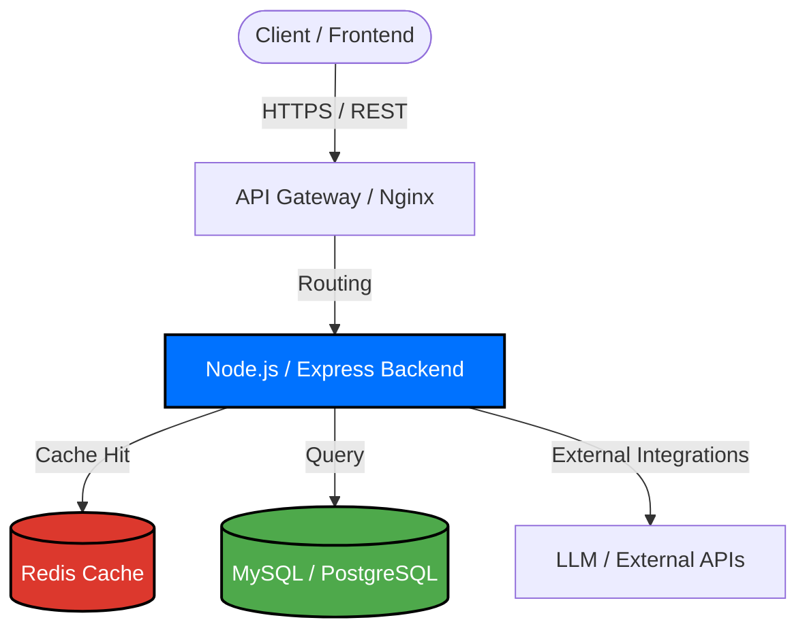

  

  
<i>Building reliable backend foundations, RESTful APIs, and scalable databases.</i>

  

    
    
  

---

## 🧠 System Architecture Mindset

---

## ⚙️ Core Technical Proficiency

  <h3>💻 Backend & Database</h3>
  
    

  <h3>🌐 Frontend Support</h3>
  
    

  <h3>☁️ DevOps, Cloud & Tools</h3>
  

---

## 🚀 Featured Infrastructure

### 🛠️ SmartQuery - AI-Powered Database Assistant
A robust backend service engineered to safely translate natural language into structured SQL queries.
- **Architecture:** Strict separation of text-processing logic from direct database operations.
- **Database Management:** Optimized connection pooling and relational schema design with `MySQL`.
- **Infrastructure:** Fully containerized using `Docker` to ensure parity across environments.

<a href="[LINK_TO_SMARTQUERY_REPO]"><strong>🌐 View System Source Code</strong></a>

---

## 📈 Current Focus & Roadmap
- 📚 **Infrastructure:** Deep diving into Docker, AWS, and Linux deployment workflows.
- 🎯 **Algorithms:** Continuously solving data structure problems on LeetCode.
- 🗣️ **Communication:** Honing technical English to consume advanced engineering documentation.
